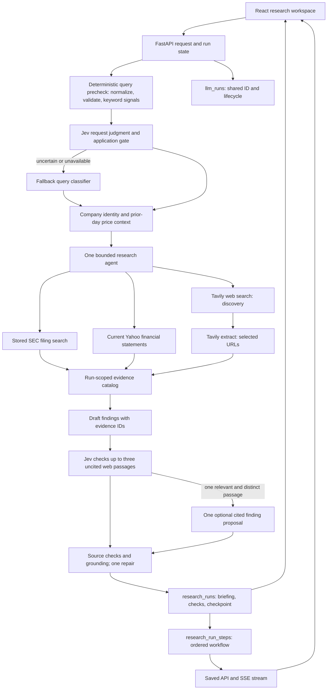

# Research Briefing Agent

## Demo contract

**Input:** a public-company symbol, timezone-aware `as_of` timestamp, research question, audience, and time horizon.

The Research UI sets `as_of` automatically when each question is submitted (with a one-minute clock-skew buffer); it is no longer an editable field. The timestamp freezes the run's source cutoff, is saved with the result, and is included in its request fingerprint. Direct API clients can still pass an explicit historical `as_of`, subject to provider limits.

**Output:** a saved `ResearchBriefing` with an executive summary, findings with source evidence, outlook, limitations, and a `VerificationResult`. The UI exposes the cited passages and financial values alongside the run's verification and trace metadata.

**Design question:** when should a research agent choose another source, and how can the application keep its final claims tied to exact evidence?

## Request flow



The agent uses a tool loop because source selection depends on intermediate results. Before Jev, a deterministic precheck normalizes the question, rejects invalid symbol, cutoff, or question text, and records bounded topic and instruction-pattern keyword signals. Those signals inform Jev but do not decide semantic relevance or safety. Jev then judges company relevance and whether the question attempts to redirect the assistant; application thresholds accept, reject, or invoke the existing query classifier when the judgment is uncertain or unavailable. The application owns that branch, the request schema, allowed tools, step and time budgets, evidence catalog, database writes, and final verification. It does not use multiple research agents or an application-managed planning queue.

### Evidence and sources

- SEC filings are explicitly loaded through the filing setup panel, chunked, embedded, and searched with metadata filters. This setup uses external services; it is not part of the offline test run.
- Yahoo Finance supplies company identity, daily close prices, and current financial statements. Mutable snapshot metrics are not citable; daily prices on the `as_of` date are excluded. The financial statement tool declines `as_of` requests more than ten minutes old because the provider's current view cannot establish what was available then. The UI sets a fresh cutoff at each submission; historical cutoffs remain possible through the API.
- Tavily Search supplies dated discovery metadata for bounded company-scoped news or general web queries. Undated, later-than-`as_of`, and wrong-company results are excluded. The agent must extract selected URLs before citing them. Extraction stores up to two distinct exact passages per selected page and registers citable evidence IDs. Jev reviews at most three uncited passages for relevance and novelty against the draft; one strong candidate can trigger one optional finding proposal. That finding still needs ordinary provenance and grounding verification. Final cited, excluded, or failed-review decisions are saved and shown in the Briefing. Publication dates are provider estimates and extracted content is the current page, so historical availability is not proven.
- The model chooses evidence IDs but does not author source metadata. Python hydrates the final output from the run-scoped evidence catalog and verifies document offsets, company and publication scope, and financial field paths. Request, tool, provider, evidence, and output contracts live in `contracts.py`.

A grounding classifier checks each finding. A rejected finding receives at most one repair attempt; findings that still fail are excluded. The summary and outlook are rebuilt from retained findings and checked again, with deterministic fallbacks. `approval_ready` describes automated checks; there is no implemented human approve/reject workflow.

The Briefing keeps question-specific limitations from the draft and verified evidence checks. Tool caps and source-handling rules stay in the Run walkthrough and documentation rather than appearing as blanket limitations on every report. Four boilerplate notes in older saved briefings are hidden in the presentation without changing their saved payloads. Citation keywords beside each finding's unique source count reveal the exact evidence and locator on hover, focus, or click.

### State and limits

Research attempts share their UUID and lifecycle with `llm_runs`. `research_runs` saves the request, briefing, verification, usage, model/prompt/tool versions, trace ID, and checkpoint. Ordered `research_run_steps` include model-visible inputs, Jev judgment and application decision, tool arguments and results, verification decisions, checkpoint writes, and stop reason. `POST /agent/research_brief/stream` emits each step after persistence and then emits the final result or error. `GET /research-runs/{id}` returns the saved steps. The UI shows live and saved steps in five expandable Run stages, then opens the cited Briefing. The page-header System architecture button opens a large diagram modal showing the execution boundaries. Model private reasoning and provider internals are unavailable.

The request fingerprint includes the full `as_of` instant and workflow versions. The workflow has a 180-second timeout and concurrency limit; the agent has a 120-second timeout and request, tool-call, and token limits. A failed run can resume from the post-agent checkpoint as a **new linked attempt**; the failed attempt remains terminal. These controls demonstrate the shape of a bounded workflow, not a guarantee of live reliability.

This is the narrow first slice of the broader research/workflow design: one company-research request, one bounded agent, three source families, a persisted run, and automated evidence verification. There is no general task planner, worker queue with automatic retry, parallel subtask fan-out, or human approval action. Checkpoint resume starts a new linked attempt only when the same request is submitted again after a failed post-agent run.

## Local development

Use Python 3.13, PostgreSQL with the `vector` extension, and the dependencies in `backend/requirements.txt`. Set `DATABASE_URL`, `OPENAI_API_KEY`, `TAVILY_API_KEY`, and `TYPESAFE_API_KEY` in `backend/.env`. Create a fresh database schema with `backend.db.db_utils.init_db()` after enabling `vector`. For an existing database, apply `backend/db/migrations/006_research_shared_runs_and_steps.sql` after migrations 001–004; `create_all()` does not alter existing tables. Migration 006 was applied to this checkout's configured database on 2026-09-30 and linked all 15 existing research rows. The UI also needs Node and the dependencies in `frontend/package-lock.json`. See the [root README](../../README.md#run-the-backend-locally) for setup.

```sh
# From the repository root, after dependencies and services are ready:
python -m uvicorn backend.main:app --reload
cd frontend && npm ci && npm run dev
```

The UI uses `http://127.0.0.1:8000` by default. Filing setup is in the Admin view. News is discovered during a run, so it does not need a separate backfill. The `research_smoke.py` script is a **live** run and uses external providers and LLM calls; it is intentionally excluded from offline verification.

## Offline verification

```sh
LOGFIRE_SEND_TO_LOGFIRE=false .venv/bin/python -m unittest discover -s backend/research_workflow/tests -v
cd frontend && npm run build && npm run lint && npm test
```

Tests mock provider calls and cover evidence contracts, Tavily filtering and extraction, Jev request and web passage adapter shapes, agent tool responses, a multi-tool fake-model agent run, web coverage proposals and timeout fallback, shared run lifecycle, failed-checkpoint resume, saved step order, SSE order, stream parsing, and request/cache boundaries. A local mock API was used to inspect the live and saved Run/Briefing UI before this follow-up. These checks do not establish live provider behavior or briefing quality. There is no representative end-to-end evaluation set yet.

## Demo limits

This is a local architecture demonstration. It lacks authentication, source-level access control, human approval actions, a durable worker queue, and measured quality/latency/cost evaluations. Tavily date estimates and current-page extraction cannot prove historical page content. Provider failures and data quality can still prevent a successful briefing. The UI renders structured briefing fields and evidence directly rather than exporting Markdown.
