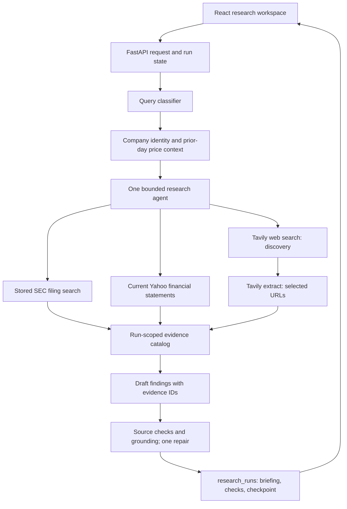

# Research Briefing Agent

## Demo contract

**Input:** a public-company symbol, timezone-aware `as_of` timestamp, research question, audience, and time horizon.

**Output:** a saved `ResearchBriefing` with an executive summary, findings with source evidence, outlook, limitations, and a `VerificationResult`. The UI exposes the cited passages and financial values alongside the run's verification and trace metadata.

**Design question:** when should a research agent choose another source, and how can the application keep its final claims tied to exact evidence?

## Request flow



The agent uses a tool loop because source selection depends on intermediate results. The application owns the request schema, allowed tools, step and time budgets, evidence catalog, database writes, and final verification. It does not use multiple research agents or an application-managed planning queue.

### Evidence and sources

- SEC filings are explicitly loaded through the filing setup panel, chunked, embedded, and searched with metadata filters. This setup uses external services; it is not part of the offline test run.
- Yahoo Finance supplies company identity, daily close prices, and current financial statements. Mutable snapshot metrics are not citable; daily prices on the `as_of` date are excluded. The financial statement tool declines historical `as_of` requests because the provider's current view cannot establish what was available then.
- Tavily Search supplies dated discovery metadata for bounded company-scoped news or general web queries. Undated, later-than-`as_of`, and wrong-company results are excluded. The agent must extract selected URLs before citing them. Extraction stores exact passages and registers citable evidence IDs. Publication dates are provider estimates and extracted content is the current page, so historical availability is not proven.
- The model chooses evidence IDs but does not author source metadata. Python hydrates the final output from the run-scoped evidence catalog and verifies document offsets, company and publication scope, and financial field paths. Request, tool, provider, evidence, and output contracts live in `contracts.py`.

A grounding classifier checks each finding. A rejected finding receives at most one repair attempt; findings that still fail are excluded. The summary and outlook are rebuilt from retained findings and checked again, with deterministic fallbacks. `approval_ready` describes automated checks; there is no implemented human approve/reject workflow.

### State and limits

Research runs are saved with request, briefing, verification, usage, model/prompt/tool versions, trace ID, and checkpoint data. The request fingerprint includes the full `as_of` instant and workflow versions. The workflow has a 180-second timeout and concurrency limit; the agent has a 120-second timeout and request, tool-call, and token limits. A failed run can resume from the post-agent checkpoint. These controls demonstrate the shape of a bounded workflow, not a guarantee of live reliability.

Follow-up for the portfolio-wide demo requirement: add an in-app ordered execution trace showing model-visible context, each selected tool with exact inputs and results, grounding and repair steps, checkpoint writes, and final state. The current UI shows the briefing, evidence, verification, and trace metadata, but not that full sequence.

## Local development

Use Python 3.13, PostgreSQL with the `vector` extension, and the dependencies in `backend/requirements.txt`. Set `DATABASE_URL`, `OPENAI_API_KEY`, and `TAVILY_API_KEY` in `backend/.env`. Create the database schema with `backend.db.db_utils.init_db()` after enabling `vector`. The UI also needs Node and the dependencies in `frontend/package-lock.json`. See the [root README](../../README.md#run-the-backend-locally) for step-by-step backend and frontend commands.

```sh
# From the repository root, after dependencies and services are ready:
python -m uvicorn backend.main:app --reload
cd frontend && npm ci && npm run dev
```

The UI uses `http://127.0.0.1:8000` by default. Filing setup is in the Admin view. News is discovered during a run, so it does not need a separate backfill. The `research_smoke.py` script is a **live** run and uses external providers and LLM calls; it is intentionally excluded from offline verification.

## Offline verification

```sh
LOGFIRE_SEND_TO_LOGFIRE=false .venv/bin/python -m unittest discover -s backend/research_workflow/tests -v
cd frontend && npm run build && npm run lint
```

Tests mock provider calls and cover evidence contracts, Tavily filtering and extraction, agent tool responses, a multi-tool fake-model agent run, and request/cache boundaries. They do not establish live provider behavior or briefing quality. There is no representative end-to-end evaluation set yet.

## Demo limits

This is a local architecture demonstration. It lacks authentication, source-level access control, human approval actions, a durable worker queue, and measured quality/latency/cost evaluations. Tavily date estimates and current-page extraction cannot prove historical page content. Provider failures and data quality can still prevent a successful briefing. The UI renders structured briefing fields and evidence directly rather than exporting Markdown.
